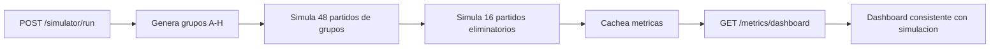
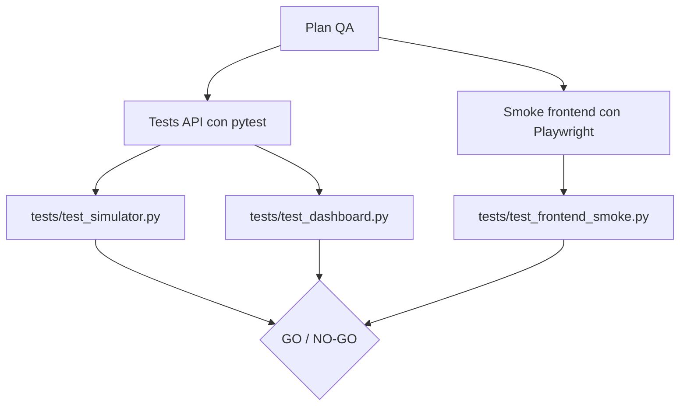
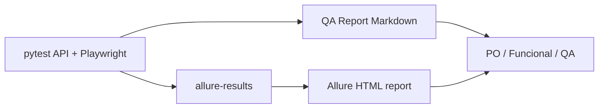
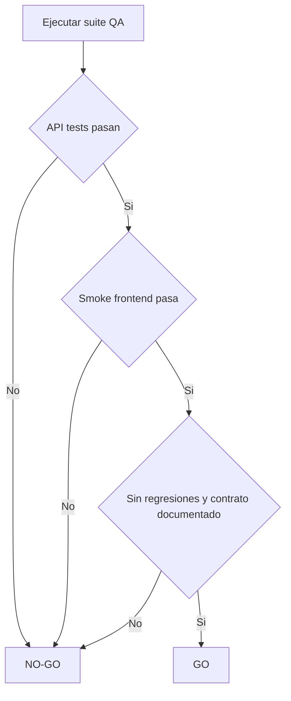

# QA Strategy - POST /simulator/run

## Alcance

Esta estrategia cubre el endpoint `POST /simulator/run`, la consistencia de `/metrics/dashboard` despues de una simulacion y el smoke test frontend del flujo principal.

Fuera de alcance: CRUD completo de equipos y jugadores, validaciones visuales pixel-perfect y pruebas de performance.

## Contrato Validado

- La simulacion debe generar 8 grupos, de A a H.
- Cada grupo debe tener exactamente 4 equipos y 6 partidos.
- El total de partidos del torneo es 64: 48 de grupos, 8 octavos, 4 cuartos, 2 semifinales, 1 tercer puesto y 1 final.
- `champion` debe coincidir con `final.winner`.
- El dashboard debe reflejar la ultima simulacion ejecutada.
- El frontend debe permitir ejecutar la simulacion y renderizar resultados, bracket y dashboard.



## Casos de Prueba en Gherkin

Estos escenarios estan escritos para que puedan ser leidos por PO, funcionales, QA y developers. Mantienen los IDs tecnicos para trazabilidad con los tests automatizados actuales.

```gherkin
Feature: Simulacion completa del Mundial 2026
  Como usuario del simulador
  Quiero ejecutar una simulacion completa del Mundial
  Para conocer grupos, eliminatorias, final y campeon

  Background:
    Given que la API del Simulador Mundial 2026 esta disponible

  Scenario: API-SIM-001 - Ejecutar la simulacion completa
    When ejecuto el endpoint POST "/simulator/run"
    Then la respuesta debe tener status 200
    And debe incluir grupos, octavos, cuartos, semifinales, tercer puesto, final y campeon

  Scenario: API-SIM-002 - Generar exactamente 8 grupos
    When ejecuto el endpoint POST "/simulator/run"
    Then la respuesta debe contener exactamente 8 grupos
    And los grupos deben ser A, B, C, D, E, F, G y H

  Scenario: API-SIM-003 - Distribuir 4 equipos por grupo
    When ejecuto el endpoint POST "/simulator/run"
    Then cada grupo debe tener exactamente 4 equipos en la tabla de posiciones
    And al consultar GET "/teams/" cada grupo debe tener exactamente 4 equipos asignados

  Scenario: API-SIM-004 - Calcular 64 partidos del torneo
    When ejecuto el endpoint POST "/simulator/run"
    Then la fase de grupos debe tener 48 partidos
    And la fase eliminatoria debe tener 16 partidos
    And el total del torneo debe ser 64 partidos

  Scenario: API-SIM-005 - Confirmar que el campeon gana la final
    When ejecuto el endpoint POST "/simulator/run"
    Then el campeon informado debe ser el mismo equipo que figura como ganador de la final
```

```gherkin
Feature: Dashboard posterior a la simulacion
  Como PO o usuario funcional
  Quiero ver metricas consistentes luego de simular el torneo
  Para confiar en los indicadores ejecutivos del dashboard

  Background:
    Given que ya se ejecuto una simulacion completa con POST "/simulator/run"

  Scenario: API-DASH-001 - Consultar dashboard luego de simular
    When consulto el endpoint GET "/metrics/dashboard"
    Then la respuesta debe tener status 200
    And debe incluir campeon, goleador, promedio de goles, goles totales y partidos totales

  Scenario: API-DASH-002 - Mostrar el mismo campeon que la simulacion
    When consulto el endpoint GET "/metrics/dashboard"
    Then el campeon del dashboard debe coincidir con el campeon de la simulacion
    And tambien debe coincidir con el ganador de la final

  Scenario: API-DASH-003 - Informar 64 partidos totales
    When consulto el endpoint GET "/metrics/dashboard"
    Then el campo "total_matches" debe ser 64

  Scenario: API-DASH-004 - Calcular promedio de goles consistente
    When consulto el endpoint GET "/metrics/dashboard"
    Then el total de goles debe coincidir con los goles de la simulacion
    And el promedio de goles debe ser "total_goals / total_matches" redondeado a 2 decimales
```

```gherkin
Feature: Smoke test del flujo principal frontend
  Como usuario del frontend
  Quiero simular el Mundial desde la pantalla principal
  Para ver rapidamente resultados, campeon, bracket y dashboard

  Background:
    Given que la aplicacion web esta disponible en "http://127.0.0.1:8000"

  Scenario: FE-SMOKE-001 - Cargar la app y ejecutar simulacion
    When ingreso a la aplicacion web
    Then debo ver el boton "Simular Mundial"
    When presiono el boton "Simular Mundial"
    Then la aplicacion debe ejecutar POST "/simulator/run" correctamente

  Scenario: FE-SMOKE-002 - Mostrar campeon, bracket y dashboard
    Given que la simulacion finalizo correctamente
    Then la seccion de resultados debe estar visible
    And el campeon debe mostrarse en "#championResult"
    And el bracket debe mostrarse en "#bracketResult"
    And el dashboard debe mostrarse en "#dashboardResult"

  Scenario: FE-SMOKE-003 - Validar vista mobile sin scroll horizontal
    Given que la simulacion finalizo correctamente
    When visualizo la aplicacion en un viewport mobile de 375px
    Then la pagina no debe presentar scroll horizontal
```



## Cobertura Existente y Ajustes

Ya existia cobertura para estructura de respuesta, grupos, campeon/final, eliminatoria sin empates, autogeneracion de equipos/jugadores y dashboard basico.

Ajustes aplicados:

- Se hizo explicito el contrato de 64 partidos en `tests/test_simulator.py`.
- Se reforzo la consistencia del dashboard contra la ultima simulacion en `tests/test_dashboard.py`.
- Se agrego smoke frontend automatizado en `tests/test_frontend_smoke.py`.
- Se corrigio `QA.md`, que indicaba 80 partidos aunque el contrato real del torneo es 64.

## Uso Futuro con behave

`behave` permite ejecutar escenarios escritos en Gherkin usando archivos `.feature` y step definitions en Python. En esta iteracion los escenarios Gherkin quedan como documentacion funcional trazable, no como suite BDD ejecutable.

Para automatizar estos escenarios con `behave` en una etapa posterior:

- Mover cada bloque `Feature` a archivos bajo `features/`.
- Crear step definitions Python para mapear `Given`, `When`, `Then` y `And`.
- Reutilizar `TestClient` para API y Playwright para frontend.
- Agregar `behave` a las dependencias solo cuando se creen escenarios ejecutables.

## Reporterias

La evidencia de QA queda disponible en dos niveles:

- Markdown: este archivo funciona como estrategia, trazabilidad funcional y QA Report legible.
- Allure Report: pytest puede generar resultados navegables para evidencia de ejecucion automatizada.



Allure requiere dos piezas:

- Python plugin: `allure-pytest`, instalado desde `requirements.txt`.
- Allure CLI: necesario para `allure serve` o `allure generate`; se instala por fuera de Python.

## Comandos

Instalacion:

```bash
pip install -r requirements.txt
python -m playwright install chromium
```

API:

```bash
pytest tests/test_simulator.py tests/test_dashboard.py -v
pytest tests/test_simulator.py tests/test_dashboard.py -v --alluredir=allure-results
```

Frontend smoke:

```bash
python -m uvicorn main:app --reload --port 8000
$env:APP_URL="http://127.0.0.1:8000"; pytest tests/test_frontend_smoke.py -v
$env:APP_URL="http://127.0.0.1:8000"; pytest tests/test_frontend_smoke.py -v --alluredir=allure-results
```

Suite completa:

```bash
pytest tests/ -v
pytest tests/ --cov=. --cov-report=term-missing
$env:APP_URL="http://127.0.0.1:8000"; pytest tests/ -v --alluredir=allure-results
```

Allure Report:

```bash
allure serve allure-results
allure generate allure-results -o allure-report --clean
```

## Criterio GO / NO-GO



GO:

- Todos los tests API pasan.
- Smoke Playwright pasa contra `http://127.0.0.1:8000` o la URL indicada en `APP_URL`.
- No hay regresion en suite completa.
- La documentacion refleja 64 partidos.

NO-GO:

- Algun grupo no tiene exactamente 4 equipos.
- `champion` no coincide entre simulacion, final y dashboard.
- Dashboard no esta disponible despues de simular.
- `total_matches` no es 64.
- Frontend no renderiza campeon, bracket o dashboard.
- Hay scroll horizontal en mobile 375px.

## QA Report

Fecha de ejecucion: 2026-06-11.

Resultado:

- API-SIM-001 a API-SIM-004: PASS.
- API-DASH-001 a API-DASH-004: PASS.
- FE-SMOKE-001 a FE-SMOKE-003: PASS con servidor externo en `http://127.0.0.1:8000`.

Evidencia:

- `pytest tests/test_simulator.py tests/test_dashboard.py -v`: 53 passed, 1 warning.
- `$env:APP_URL="http://127.0.0.1:8000"; pytest tests/test_frontend_smoke.py -v`: 1 passed, 1 warning.
- `$env:APP_URL="http://127.0.0.1:8000"; pytest tests/ -v`: 70 passed, 1 warning.
- `$env:APP_URL="http://127.0.0.1:8000"; pytest tests/ --cov=. --cov-report=term-missing`: 70 passed, 1 warning, 90% total coverage.
- `pytest tests/test_simulator.py tests/test_dashboard.py -v --alluredir=allure-results --clean-alluredir`: 53 passed, 1 warning.
- `$env:APP_URL="http://127.0.0.1:8000"; pytest tests/test_frontend_smoke.py -v --alluredir=allure-results`: 1 passed, 1 warning.
- `allure-results`: generado correctamente con resultados crudos para Allure Report.
- `QA.md` y este reporte documentan el contrato de 64 partidos.

Riesgos residuales:

- El smoke frontend depende de que `uvicorn` este corriendo antes de ejecutar Playwright.
- El resultado deportivo es aleatorio; los tests validan invariantes de negocio, no equipos ganadores especificos.
- La visualizacion HTML de Allure depende de tener Allure CLI instalado en la maquina. En esta ejecucion no se encontro `allure` en el PATH.
